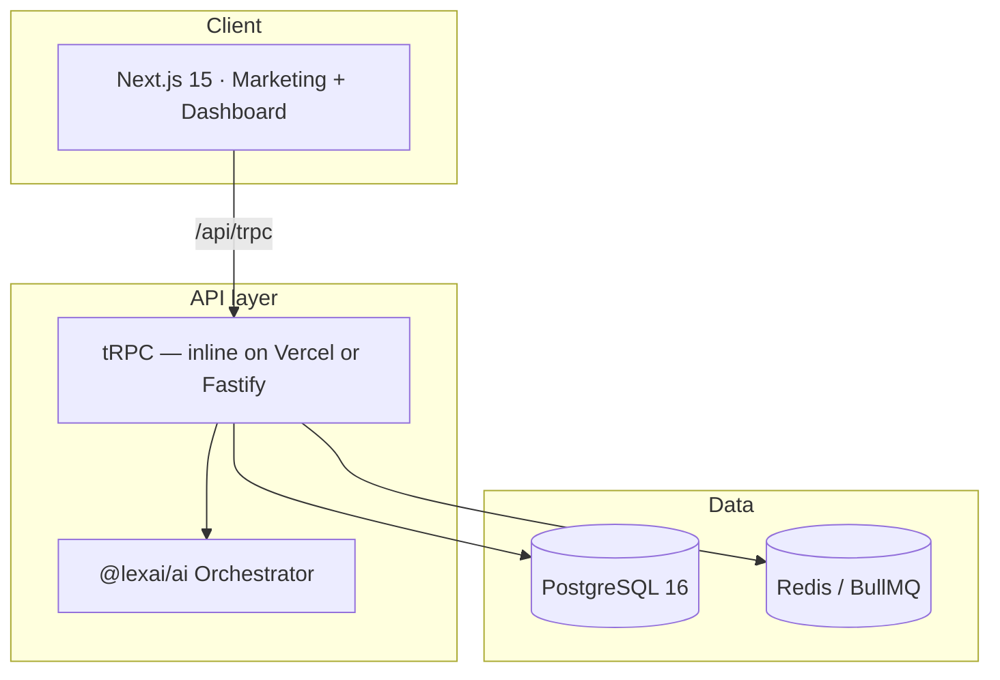

<div align="center">

# LexAI v2

**Premium AI legal intelligence platform for Spanish law**

Multi-area consultations · Case memory · Document analysis · Legal drafting · GDPR-native compliance

<br/>

[](https://github.com/thedevroom/lexai/actions/workflows/ci.yml)
[](LICENSE)
[](package.json)
[](apps/web)
[](tsconfig.base.json)
[](package.json)

[**Live demo**](https://lexai-bay.vercel.app) · [**Architecture**](./docs/ARCHITECTURE.md) · [**Deployment**](./docs/DEPLOYMENT.md) · [**Report a bug**](https://github.com/thedevroom/lexai/issues/new?template=bug_report.yml)

<br/>

⭐ **If this project is useful to you, a star helps more developers and law firms discover it.**

[](https://github.com/thedevroom/lexai/stargazers)

</div>

---

## Why LexAI

Law firms and in-house legal teams need AI that **understands Spanish law** — not a generic chatbot. LexAI delivers:

| Challenge | LexAI solution |
|-----------|----------------|
| Chatbots without legal structure | **IRAC** methodology and validated `LegalResponse` schema |
| GDPR / LSSI compliance risk | Consent management, audit trails, data export & deletion |
| Unpredictable API costs | **Smart local engine** + optional xAI with automatic fallback |
| Outdated legal software | Premium dark-first UI, interactive demo, PWA-ready |

---

## Key features

<table>
<tr>
<td width="50%">

### Legal AI
- **9 practice areas**: labor, civil, criminal, tax, family, consumer, traffic, immigration, commercial
- Orchestrator with complexity classification
- Reinforced disclaimers for criminal & tax matters
- 2,000+ token system prompts per area

</td>
<td width="50%">

### Production-ready product
- Landing with **60s interactive demo**
- Legal pages (terms, privacy, cookies, legal notice)
- **Admin** panel with users & audit logs
- SEO: `robots.ts`, `sitemap.ts`, Open Graph

</td>
</tr>
<tr>
<td>

### Security & compliance
- **AES-256-GCM** encryption
- GDPR compliance router
- Rate limiting & abuse prevention
- Audit logs for sensitive actions

</td>
<td>

### Developer experience
- **Turborepo + pnpm** monorepo
- End-to-end typed tRPC
- CI with lint, test, build
- Embedded PostgreSQL — no Docker required

</td>
</tr>
</table>

---

## Architecture



> **Production on Vercel:** tRPC runs inline via Next.js serverless routes when `DATABASE_URL` points to a cloud database (e.g. [Neon](https://neon.tech)). No separate API server required.

Full details in [docs/ARCHITECTURE.md](./docs/ARCHITECTURE.md).

---

## Quick start

```bash
git clone https://github.com/thedevroom/lexai.git
cd lexai
pnpm install
cp .env.example .env    # Windows: copy .env.example .env
pnpm start
```

| Service | URL |
|---------|-----|
| Web | http://localhost:3000 |
| API | http://localhost:4000/health |

`pnpm start` runs preflight checks, embedded database, migrations, seed, and smoke tests.

### Demo accounts (after `pnpm db:seed`)

| Role | Email | Password |
|------|-------|----------|
| Admin | `admin@lexai.es` | `AdminLexAI2026!` |
| User | `demo@lexai.es` | `DemoLexAI2026!` |

---

## Tech stack

<p align="center">
  
  
  
  
  
  
</p>

---

## Deployment

| Platform | Use case |
|----------|----------|
| [**Vercel**](https://vercel.com) | Next.js app + **inline tRPC** + Neon Postgres |
| Railway / Render / Docker | Standalone Fastify API (optional split architecture) |

[](https://vercel.com/new/clone?repository-url=https%3A%2F%2Fgithub.com%2Fthedevroom%2Flexai&project-name=lexai&root-directory=apps%2Fweb)

Step-by-step guide: [docs/DEPLOYMENT.md](./docs/DEPLOYMENT.md)

---

## Monorepo structure

```
lexai/
├── apps/
│   ├── web/          # Next.js — landing, dashboard, admin, legal
│   └── api/          # Fastify + tRPC + Prisma (local dev & optional split deploy)
├── packages/
│   ├── ai/           # Orchestrator & legal agents
│   ├── shared/       # Types, Zod schemas, legal constants
│   └── design-tokens/
├── docker/           # Compose + Dockerfiles
├── docs/             # Architecture, deployment, compliance
└── scripts/          # Startup & smoke tests
```

---

## Roadmap

- [x] Monorepo, CI, 31 Vitest tests
- [x] 9 legal areas + AI orchestrator
- [x] Dashboard, admin, legal pages, cookies
- [x] Interactive landing demo
- [x] Vercel deployment with inline tRPC
- [ ] 24/7 voice (LiveKit + Twilio)
- [ ] Extended Playwright E2E
- [ ] Offline-capable PWA

---

## Documentation

| Document | Description |
|----------|-------------|
| [Architecture](./docs/ARCHITECTURE.md) | System design |
| [Development](./docs/DEVELOPMENT.md) | Conventions & commands |
| [Deployment](./docs/DEPLOYMENT.md) | Vercel, Neon, Docker, env vars |
| [Showcase](./docs/SHOWCASE.md) | Product screenshots & flows |
| [GDPR](./docs/legal-compliance.md) | Legal compliance |
| [xAI](./docs/xai-integration.md) | Optional AI integration |
| [Contributing](./CONTRIBUTING.md) | Contributor guide |

---

## Contributing

Ideas, bugs, or improvements? Read [CONTRIBUTING.md](./CONTRIBUTING.md) and open an issue or PR.

---

## License

Proprietary code — see [LICENSE](./LICENSE).

---

<div align="center">

**[thedevroom/lexai](https://github.com/thedevroom/lexai)** · Built with care for Spanish legaltech

⭐ **Star** · 🐛 **Issues** · 🍴 **Fork** · 📣 **Share**

</div>
