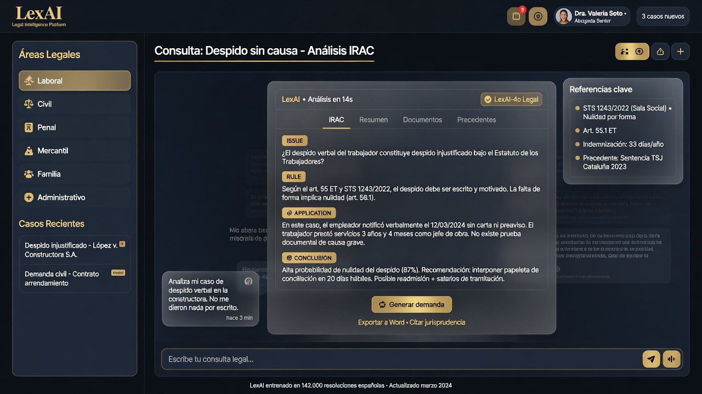

<div align="center">


# LexAI v2

**Despacho digital de inteligencia artificial jurídica en español**

Consultas multi-área · Memoria de expedientes · Análisis documental · Escritos legales · RGPD nativo

<br/>

[](https://github.com/thedevroom/lexai/actions/workflows/ci.yml)
[](LICENSE)
[](package.json)
[](apps/web)
[](tsconfig.base.json)
[](package.json)

[**Demo en vivo**](https://lexai-bay.vercel.app) · [**Documentación**](./docs/ARCHITECTURE.md) · [**Despliegue**](./docs/DEPLOYMENT.md) · [**Reportar bug**](../../issues/new?template=bug_report.yml)

<br/>

⭐ **Si este proyecto te resulta útil, una estrella ayuda a que más desarrolladores y despachos lo descubran.**

[](https://github.com/thedevroom/lexai/stargazers)

</div>

---

## Por qué LexAI

Los despachos y departamentos legales necesitan IA que **entienda el derecho español**, no un chat genérico. LexAI combina:

| Problema | Solución LexAI |
|----------|----------------|
| Chatbots sin marco jurídico | Metodología **IRAC** y esquema `LegalResponse` validado |
| Riesgo RGPD / LSSI | Consentimientos, auditoría, exportación y borrado de datos |
| Coste API impredecible | **Motor local inteligente** + xAI opcional con fallback automático |
| Software legal anticuado | UI premium dark-first, demo interactiva, PWA-ready |

---

## Vista previa

<div align="center">



*Interfaz de consulta jurídica con áreas especializadas y respuestas estructuradas*

</div>

---

## Características principales

<table>
<tr>
<td width="50%">

### IA jurídica
- **9 áreas**: laboral, civil, penal, fiscal, familia, consumidor, tráfico, extranjería, mercantil
- Orquestador con clasificación de complejidad
- Disclaimers reforzados en penal y fiscal
- Prompts de sistema de 2000+ tokens por área

</td>
<td width="50%">

### Producto listo para producción
- Landing con **demo interactiva 60s**
- Páginas legales (términos, privacidad, cookies, aviso legal)
- Panel **admin** con usuarios y auditoría
- SEO: `robots.ts`, `sitemap.ts`, Open Graph

</td>
</tr>
<tr>
<td>

### Seguridad & compliance
- Cifrado **AES-256-GCM**
- Router de cumplimiento RGPD
- Rate limiting y anti-abuso
- Audit logs de acciones sensibles

</td>
<td>

### Developer experience
- Monorepo **Turborepo + pnpm**
- tRPC end-to-end tipado
- CI con lint, test, build
- PostgreSQL embebido sin Docker

</td>
</tr>
</table>

---

## Arquitectura

```mermaid
flowchart TB
  subgraph Cliente
    WEB[Next.js 15 · Marketing + Dashboard]
  end
  subgraph Backend
    API[Fastify + tRPC + Prisma]
    AI[@lexai/ai Orquestador]
  end
  subgraph Datos
    PG[(PostgreSQL 16)]
    RD[(Redis / BullMQ)]
  end
  WEB -->|tRPC| API
  API --> AI
  API --> PG
  API --> RD
```

Detalle completo en [docs/ARCHITECTURE.md](./docs/ARCHITECTURE.md).

---

## Inicio rápido

```bash
git clone https://github.com/thedevroom/lexai.git
cd lexai
pnpm install
cp .env.example .env    # Windows: copy .env.example .env
pnpm start
```

| Servicio | URL |
|----------|-----|
| Web | http://localhost:3000 |
| API | http://localhost:4000/health |

`pnpm start` ejecuta preflight, base de datos embebida, migraciones, seed y smoke tests.

### Cuentas demo (tras `pnpm db:seed`)

| Rol | Email | Contraseña |
|-----|-------|------------|
| Admin | `admin@lexai.es` | `AdminLexAI2026!` |
| Usuario | `demo@lexai.es` | `DemoLexAI2026!` |

---

## Stack tecnológico

<p align="center">
  
  
  
  
  
  
</p>

---

## Despliegue

| Plataforma | Uso |
|------------|-----|
| [**Vercel**](https://vercel.com) | Frontend Next.js (marketing + UI) |
| Railway / Render / Docker | API + PostgreSQL + Redis |

[](https://vercel.com/new/clone?repository-url=https%3A%2F%2Fgithub.com%2Fthedevroom%2Flexai&project-name=lexai&root-directory=apps%2Fweb)

Guía paso a paso: [docs/DEPLOYMENT.md](./docs/DEPLOYMENT.md)

---

## Estructura del monorepo

```
lexai/
├── apps/
│   ├── web/          # Next.js — landing, dashboard, admin, legal
│   └── api/          # Fastify + tRPC + Prisma
├── packages/
│   ├── ai/           # Orquestador y agentes jurídicos
│   ├── shared/       # Tipos, Zod, constantes legales
│   └── design-tokens/
├── docker/           # Compose + Dockerfiles
├── docs/             # Arquitectura, despliegue, compliance
└── scripts/          # Arranque y smoke tests
```

---

## Roadmap

- [x] Monorepo, CI, 31 tests Vitest
- [x] 9 áreas jurídicas + orquestador IA
- [x] Dashboard, admin, páginas legales, cookies
- [x] Demo interactiva en landing
- [x] Despliegue Vercel (frontend)
- [ ] Voz 24/7 (LiveKit + Twilio)
- [ ] E2E Playwright ampliado
- [ ] App móvil PWA offline

---

## Documentación

| Documento | Descripción |
|-----------|-------------|
| [Arquitectura](./docs/ARCHITECTURE.md) | Diseño del sistema |
| [Desarrollo](./docs/DEVELOPMENT.md) | Convenciones y comandos |
| [Despliegue](./docs/DEPLOYMENT.md) | Vercel, Docker, variables |
| [Showcase](./docs/SHOWCASE.md) | Capturas y flujos de producto |
| [RGPD](./docs/legal-compliance.md) | Cumplimiento legal |
| [xAI](./docs/xai-integration.md) | Integración IA opcional |
| [Contribuir](./CONTRIBUTING.md) | Guía para colaboradores |

---

## Contribuir

¿Ideas, bugs o mejoras? Lee [CONTRIBUTING.md](./CONTRIBUTING.md) y abre un issue o PR.

---

## Licencia

Código propietario — ver [LICENSE](./LICENSE).

---

<div align="center">

**[thedevroom/lexai](https://github.com/thedevroom/lexai)** · Hecho con dedicación para la legaltech en español

⭐ **Star** · 🐛 **Issues** · 🍴 **Fork** · 📣 **Compartir**

</div>