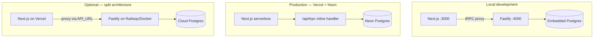

# Architecture — LexAI v2

## Overview

LexAI is a Turborepo monorepo that separates the user experience (Next.js), business logic and persistence (tRPC + Prisma), and legal reasoning (`@lexai/ai` package).

```
┌─────────────────────────────────────────────────────────────┐
│  apps/web (Next.js 15)                                      │
│  Marketing · Dashboard · Admin · Legal · PWA                │
│  /api/trpc — inline handler (Vercel) or proxy (split mode)  │
└──────────────────────────┬──────────────────────────────────┘
                           │ tRPC
┌──────────────────────────▼──────────────────────────────────┐
│  apps/api (Fastify — local dev / optional split deploy)       │
│  Auth · Cases · Consultations · Documents · Compliance        │
│  Admin · Billing · Voice (base)                               │
└──────┬───────────────────────────────┬──────────────────────┘
       │                               │
       ▼                               ▼
┌──────────────┐              ┌────────────────┐
│ PostgreSQL   │              │ Redis / BullMQ │
│ (Prisma)     │              │ rate limit     │
└──────────────┘              └────────────────┘
       │
       ▼
┌─────────────────────────────────────────────────────────────┐
│  packages/ai — LexAIOrchestrator                            │
│  Classification · xAI routing · Local fallback · IRAC       │
└─────────────────────────────────────────────────────────────┘
```

## Deployment modes



| Mode | Detection | `API_URL` required? |
|------|-----------|---------------------|
| Local | `DATABASE_URL` contains `localhost` | Yes (defaults to `:4000`) |
| Inline (Vercel) | Cloud `DATABASE_URL` detected | **No** |
| Split | Cloud `DATABASE_URL` + `API_URL` set | Yes |

Inline mode is controlled by `useInlineTrpc()` in `apps/web/src/lib/api-config.ts`.

## Packages

### `apps/web`

- **App Router** with public routes (landing, product, legal) and protected routes (`AuthGuard`, `AdminGuard`)
- **tRPC client** typed against the shared `AppRouter`
- **Inline tRPC handler** at `src/app/api/trpc/[...path]/route.ts` for Vercel serverless
- **Design system** based on tokens (`@lexai/design-tokens`) and reusable components
- **Interactive demo** on the landing page (`#demo`)

### `apps/api`

- **tRPC** as the primary API layer with session, IP, and user-agent context
- **Prisma** models: users, cases, consultations, documents, consents, audit logs
- **Middleware** for rate limiting, abuse prevention, and roles (`USER`, `ADMIN`)
- **Decoupled services**: consultation AI, R2/MinIO storage, encryption, job queues
- **Fastify server** for local development and optional split production deploy

### `packages/ai`

- **LexAIOrchestrator**: classifies queries, selects legal area and model
- **9 system prompts** per practice area (`*.system.md`)
- **Optional xAI client** with degradation to local engine (`lexai-local-fallback`)
- Output validated against `LegalResponse` schema (`@lexai/shared`)

### `packages/shared`

- Domain types, legal areas, disclaimers, and Zod schemas shared across API, web, and AI

## Legal consultation flow

1. User sends a message from the dashboard chat
2. `consultations` router validates the session and creates/updates the thread
3. `consultation-ai` invokes the orchestrator with case context
4. Orchestrator classifies complexity and area → xAI live or local fallback
5. JSON response (IRAC + citations + disclaimer) is persisted and streamed to the client
6. Audit events and consent records are logged per GDPR requirements

## Authentication & roles

- **JWT** auth via tRPC `auth` router; tokens stored client-side
- `ADMIN` role enables `/admin`, user management, and audit log access
- Seed creates admin and demo user in development

## Local infrastructure

| Mode | Postgres | Redis | Storage |
|------|----------|-------|---------|
| Embedded | `embedded-postgres` | In-memory (fallback) | `.local-storage/` |
| Docker | `docker-compose` | Redis 7 | MinIO |

Startup scripts: `scripts/start-project.mjs` and `scripts/dev-with-db.mjs`.

## Security & compliance

- **AES-256-GCM** encryption for sensitive fields and privileged documents
- `compliance` router: consent management, data export, and deletion
- Legal pages and cookie banner aligned with LSSI/GDPR
- See [legal-compliance.md](./legal-compliance.md)

## CI/CD

- **CI** (`.github/workflows/ci.yml`): lint, typecheck, test with service Postgres/Redis, build
- **E2E** (`.github/workflows/e2e.yml`): nightly Playwright (`workflow_dispatch` available)
- **Vercel build**: migrations + production bootstrap + Next.js build (see `apps/web/vercel.json`)

## Technical decisions

| Decision | Rationale |
|----------|-----------|
| tRPC end-to-end | Shared typing, less REST boilerplate |
| Inline tRPC on Vercel | Single deploy, no separate API server, Neon serverless-friendly |
| pnpm monorepo | Internal deps (`workspace:*`) and Turbo-cached builds |
| Local AI fallback | Zero API cost in dev and production resilience |
| Embedded PostgreSQL | Onboarding without Docker on Windows/macOS/Linux |